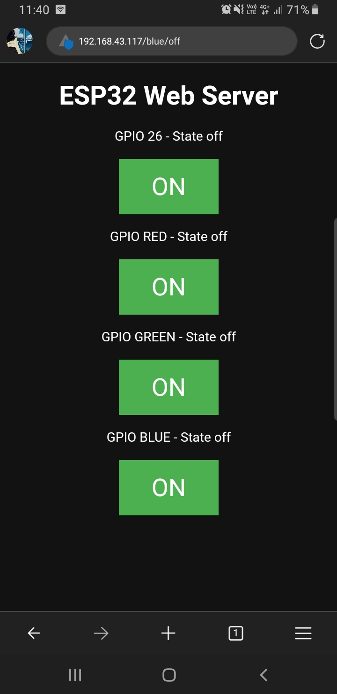

# ESP32 LED Controller

This repository contains the code for an ESP32 project that controls an LED using HTML.

## Getting Started

To get started with this project, follow the steps below:

1. Clone the repository:

   ```bash
   git clone https://github.com/your-username/led-controller.git
   ```
 

2. Open the project in Arduino IDE and change ssid and password in the code.

3. Upload the code to your ESP32.

4. Open the serial monitor and check the IP address of your ESP32.

5. Open the IP address in your browser and control the LED.


## Results


Front Page with LED On/Off Button for controlling the LED color.



## Contributing

Contributions are welcome! If you find any issues or have suggestions for improvements, please open an issue or submit a pull request.

## License

This project is licensed under the MIT License. See the [LICENSE](LICENSE) file for more information.
